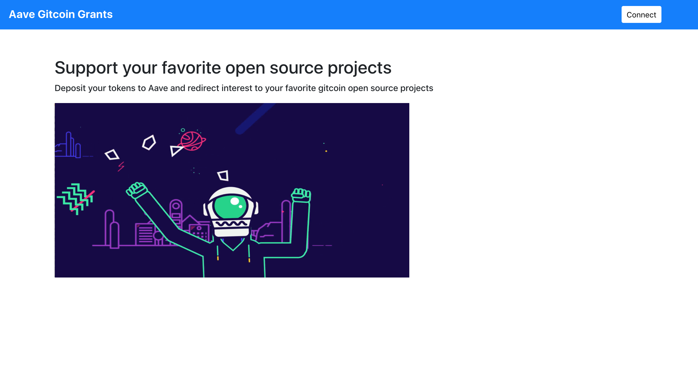
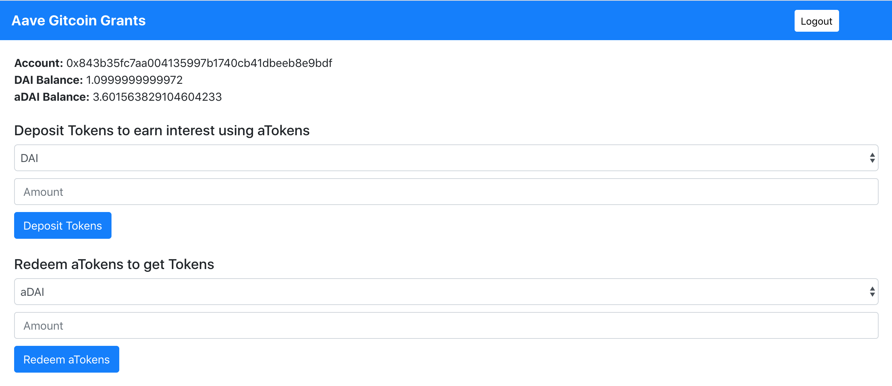
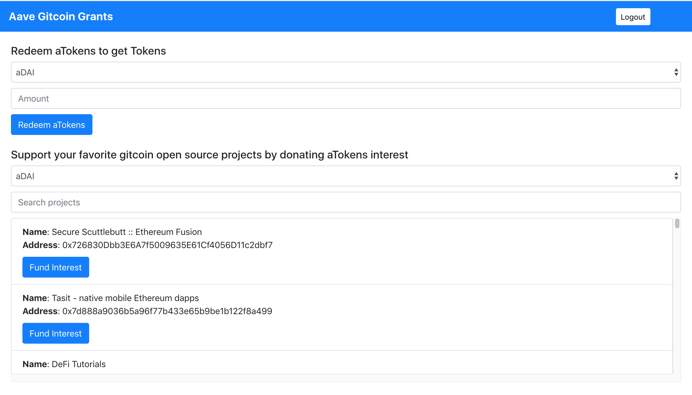

## Aave Gitcoin Grants
Aave Gitcoin Grants allows you to support your favorite open source projects. You can 
deposit your tokens to Aave and redirect interest to your favorite gitcoin open source projects.

### App Link
Aave Gitcoin Grants (Ropsten Network) - https://aave-gitcoin-grants.netlify.app/

### Screenshots







### Getting Started

1) Clone the repo

   ```
   git clone https://github.com/viraja1/aave_gitcoin_grants.git 
   ```

2) Change Directory

   ```
   cd aave_gitcoin_grants
   ```
   
3) Install packages

   ```
   npm install
   ```
   
4) Start the app   

   ```
   npm start 
   ```
   
5) Test the app

   http://localhost:3000/ 
   
6) Get tokens from faucet
    
   https://faucet.ropsten.be/
   
   https://testnet.aave.com/faucet